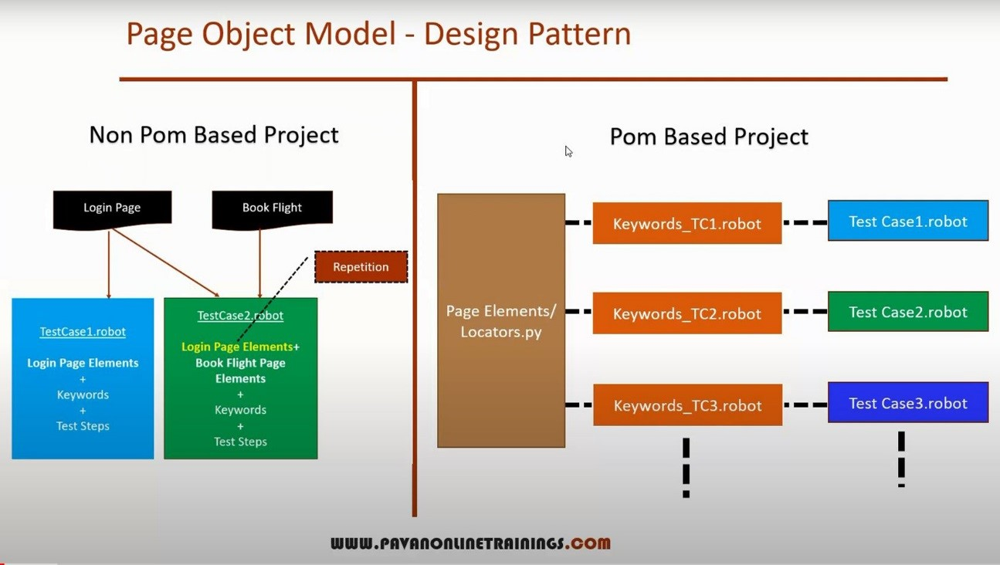

Original Learning Notes for "Web Automation Using Robot Framework - Selenium with Python"

The course is coming from YouTube SDET Channel which use Windows 10 + Pycharm IDE.

My local environment was Windows 7 + Eclipse. So the notes include a lot of my own practices.

This README.md file is converted from word document. I have ".docx" version in folder "TestData" if you prefer read it in word.

1.    Introduction to Robot Framework
=====================================

1.1 Robot Framework
-------------------

-       Robot Framework is a generic test automation framework for acceptance testing

-       Acceptance test-driven development (ATDD)

-       It utilizes the keyword-driven testing approach

-       Provides test libraries implemented either with Python or Java, and users can create new higher-level keywords from existing ones using the same syntax that is used for creating test cases.

-       Not much programming is required.

1.2 Environment Setup
---------------------

-       Check if Python is already installed in your system

		>python --version
		>pip --version

-       Download Python & Install Python & Add the path to System Variables

-       Install Selenium       

		>pip install selenium
		>pip uninstall selenium

-       Install robot framework      

		>pip install robotframework
		>pip install --upgrade robotframework
		>pip install robotframework==2.9.2
		>pip install –no-cache-dir robotframework
		>pip uninstall robotframework

-       Install Robotframework Selenium Library   

		>pip install robotframework-seleniumlibrary
		>pip uninstall robotframework-seleniumlibrary

		>pip list
		>pip show robotframework
		>pip check robotframework

 

1.3 Eclipse IDE Setup
---------------------

-       Download and Install Eclipse IDE

-       Install RED – Robot Editor from Eclipse Marketplace

	Eclipse\>\>Help\>\>Eclipse Marketplace\>\>Search for RED Robot Editor\>\>Install and Restart Eclipse

RED requires python interpreter with robot framework installed in your system.

	Eclipse\>\>Windows\>\>Preferences\>\>Robot Framework\>\>Installed frameworks

You should see the python which automatically created.
In case you have multiple version of Python you need select the correct one to use 

-       Install CodeMix3 for Python Pack from Eclipse Marketplace

-       Copy the Chromedriver.exe to ../Python37/Scripts/ Folder.

-       Running the following code to resolve [WinError 31]

ERROR: Could not install packages due to an EnvironmentError: [WinError 31] A device attached to the system is not functioning

Consider using the \`--user\` option or check the permissions.
Exception ignored in: \<\_io.TextIOWrapper name='\<stdout\>' mode='w' encoding='utf-8'\>
PermissionError: [WinError 31] A device attached to the system is not functioning

	>chcp 1252

2.    First Test Case in Robot Framework
========================================

2.1             Create New Robot Project
----------------------------------------

	Eclipse\>\>File\>\>New\>\>Robot Project: Follow the instruction

 

2.2             File Extensions, Writing Robot File, Reporting
--------------------------------------------------------------

-       Project Folder Structure

-       File Extensions - .robot

-       Multiple sections in Robot file

		   *** Settings ***		
		   *** Variables ***		
		   *** Test Cases ***		
		   *** Keywords ***

-       Writing Test Cases

-       Report

3.    How to Handle Input Box in Robot Framework
================================================

3.1             Working with Web Elements
-----------------------------------------

Import SeleniumLibrary to handle Web Elements

		Open Browser		
		Close Browser		
		Click Link    [locator]		
		Click Element [locator]		
		Click Button  [locator]		
		Click Image   [locator]

3.2             Text Box and Input Box
--------------------------------------

-       Visibility Status

		Element Should Be Visible           [locator, message]		
		Element Should Not Be Visible        [locator, message]

-       Enabled Status

		Element Should Be Enabled           [locator, message]		
		Element Should Not Be Enabled        [locator, message]

-       Provide Value

		Input Text    [locator, text]

-       Clearing Value

		lear Element Text    [locator]

 

3.3             Verify Title of the Page
----------------------------------------

		Title Should Be      [title, message]

4.    How to Select Radio Buttons & Check Boxes in Robot FW
===========================================================

		Select Radio Button          [group\_name, value]		
		Unselect Radio Button        [group\_name, value]

		Select Checkbox       [locator]		
		Unselect Checkbox    [locator]

5.    How to Select Options from Dropdown & List Boxes
======================================================

		Select From List By Label    [locator, \*labels]		
		Unselect From List By Label  [locator, \*labels]
				 	
		Select From List By Index    [locator, \*indexes]		
		Unselect From List By Index  [locator, \*indexes]		 
		
		Select From List By Value    [locator, \*values]	
		Unselect From List By Value  [locator, \*values]

6.    Waits & TimeOuts in Robot Framework
=========================================

6.1             Selenium Speed - Each step waits x seconds - causing performance issue
--------------------------------------------------------------------------------------

		Set Selenium Speed    5  		
		${Speed}      Get Selenium Speed		
		Log To Console    ${Speed}   

6.2             Selenium Timeout
--------------------------------

		${time}        Get Selenium Timeout		
		Log To Console   The default Timeout is ${time}	
		Set Selenium Timeout    10     #Wait 10 Seconds to Fail the test 		
		Wait Until Page Contains    Register 

6.3             Implicit wait
-----------------------------

		Set Selenium Implicit Wait    10		
		${implicitTime}      Get Selenium Implicit Wait		
		Log    The Default Implicit Wait time is ${implicitTime}  

6.4             Sleep
---------------------

		Sleep    3

7.    How to close Single & Multiple Browsers
=============================================

		Close Browser		
		Close All Browsers   

8.    How to Handle Alerts and Frames
=====================================

8.1             How to Handle Alerts
------------------------------------

		Handle Alert    ACCEPT		
		Handle Alert    Dismiss		
		Handle Alert    Leave
		
		Alert Should Be Present    Press a button! 		
		Alert Should Not Be Present    Press a button!

8.2             How to Handle Frames
------------------------------------

		Select Frame         [locator]		
		Unselect Frame       [locator]

 

9.    Handle Tabbed Windows and Browser Windows
===============================================

9.1             How to Handle Tabbed Windows
--------------------------------------------

		Select Window        [locator=MAIN]

9.2             How to Handle Browser Windows
---------------------------------------------

		Switch Browser       [index\_or\_alias]

10.    Browser Related Keywords
===============================================

    Open Browser    https://www.google.com    ${Browser}
    ${loc}   **Get Location**
    Log To Console    ${loc} 

    Go to    https://www.bing.com
    ${loc}   **Get Location**
    Log To Console    ${loc} 

    Go Back
    ${loc}   **Get Location**
    Log To Console    ${loc} 

11.    How to Capture Element & Full Page Screenshot
===============================================

	Capture Element Screenshot  [locator, filename=selenium-element-screenshot-{index}.png]
										xpath = //div[@id='divLogo']/img    ./screenshots/Logo.png
		C:/Users/Administrator/eclipse-workspace/RobotAutomantionSDET/screenshots/Logo.png

	Capture Page Screenshot     [filename=selenium-screenshot-{index}.png]   ./screenshots/LoginTC.png
		C:/Users/Administrator/eclipse-workspace/RobotAutomantionSDET/screenshots/LoginTC.png

**Note: The Path need to be converted to forward-slash(/) from backslash(\\) when you copy the path from the file property in Eclipse. Otherwise the path will not work.**

12.    How to Perform Mouse Operations
===============================================

12.1        Right Click
-----------------------

		Open Context Menu    	[locator]
									xpath = //span[text()='right click me']

12.2        Double Click
------------------------

		Double Click Element  [locator]    
									xpath = //button[text()='Copy Text']

12.3        Drag & Drop
-----------------------

		Drag And Drop         [locator, target]
									id = box6    id = box106

13.    User Defined Keywords
===============================================

13.1        User Defined Keyword without Arguments
--------------------------------------------------

		*** Test Cases ***
		UserKeywordsWithoutArguments		
		    LaunchBrowser		#User Keywords no Arguments		
		    Input Text      	name=userName    mercury  		
		    Input Password  	name=password    mercury    

		*** Keywords ***
		LaunchBrowser
		    Open Browser    http://www.newtours.demoaut.com/    Chrome
		    Maximize Browser Window

13.2        User Defined Keyword with Arguments
----------------------------------------------- 

		*** Keywords ***		
		UserKeywordsWithArguments		
		    LaunchBrowser    	${urlNewtours}   ${Browser}		
		    Input Text      	name=userName    mercury  		
		    Input Password 	name=password    mercury    		 
		
		*** Keywords ***		
		LaunchBrowser		
		    [Arguments]     	${appUrl}   ${appBrowser}		
		    Open Browser   	${appUrl}   ${appBrowser}		
		    Maximize Browser Window

13.3        User Defined Keyword with Arguments & Return value
--------------------------------------------------------------
	 
		*** Test Cases ***		
		UserKeywords		
		    ${pageTitle}    LaunchBrowser    ${urlNewtours}  ${Browser}		
		    Log    The Page Title is ${pageTitle}		
		    Input Text      name=userName    mercury  		
		    Input Password  name=password    mercury    
				
		*** Keywords ***
		LaunchBrowser	
		    [Arguments] 		${appUrl}   ${appBrowser}
		    Open Browser     	${appUrl}   ${appBrowser}		
		    Maximize Browser Window		
		    ${Title}        Get Title		
		    [Return]        ${Title}
		

14.    Scrolling Page Using JaveScript Executor
===============================================

14.1        Scrolling page till it reach a pixel number
-------------------------------------------------------

		Execute Javascript         window.scrollTo(0,2500)

14.2        Scrolling page till find element on page
----------------------------------------------------

		Scroll Element Into View  xpath=//td[contains(text(),'India')]

14.3        Scrolling page to end of the page – Scrolling down to Bottom
------------------------------------------------------------------------

		Execute Javascript        window.scrollTo(0,document.body.scrollHeight)

14.4        Scrolling page to starting point – Scrolling up to Top
------------------------------------------------------------------

		Execute Javascript        window.scrollTo(0,-document.body.scrollHeight)

15.    How to work with FOR Loop
===============================================

		ForLoopDemo1		
		    FOR    ${i}    IN RANGE    1    10		
		        Log    For Loop Demo1 - ${i}		
		    END		 
		
		ForLoopDemo2		
		    FOR    ${i}    IN    1  2  3  4  5  4  6  8  9		
		        Log    For Loop Demo2 - ${i}		
		    END
				
		ForLoopDemo3		
		    @{items}        Create List    1  2  3  4  7  9		
		    FOR    ${i}    IN    @{items}		
		        Log    For Loop Demo3 - ${i}		
		    END 
				
		ForLoopDemo4		
		    FOR    ${i}    IN    john  david  smith  scott		
		        Log    For Loop Demo4 - ${i}		
		    END	   
		
		ForLoopDemo5		
		    @{namesList}    Create List    john david  smith  scott		
		    FOR    ${i}    IN    @{namesList}		
		        Log    For Loop Demo5 - ${i}		
		    END
				
		ForLoopDemo6		
		    @{items}        Create List    1  2  3  4  5		
		    FOR    ${i}    IN    @{items}		
		        Log    For Loop Demo6 - ${i}		
		        Exit For Loop If    ${i}==3		
		    END  

16.    How to Count & Extract Link Texts
===============================================

16.1        Count Number of Links on Web Page
---------------------------------------------

16.2        Extract all the link texts on Web Page
--------------------------------------------------

		Open Browser     ${urlNewtours}     ${Browser}
		${AllLinksCount}       Get Element Count    xpath=//a
		Log    The Links in the Page are ${AllLinksCount}   
	
		FOR    ${i}    *N RANGE  1    ${AllLinksCount}+1	
			${linkText}       Get Text    xpath=(//a)[${i}]	
			Log To Console   ${linkText}	
		END
		
		
17.    How to Handle Web/HTML Table
===============================================		

17.1        Count Number of Rows in a Table
-------------------------------------------

17.2        Count Number of Columns in a Table
----------------------------------------------

17.3        Get data from Table
-------------------------------

17.4        Validations on the Table
------------------------------------

	    Open Browser    https://testautomationpractice.blogspot.com/    Chrome	
	    Maximize Browser Window	   
	
	    ${rows}  Get Element Count    //table[@name='BookTable']/tbody/tr	
	    ${cols}  Get Element Count    //table[@name='BookTable']/tbody/tr[1]/th
	
	    Log    The Table has ${rows} rows.	
	    Log    The Table has ${cols} columns.	   
	
	    ${cellData}     Get Text    //table[@name='BookTable']/tbody/tr[5]/td[1]	
	    Log    The text of 5th row and 1st column is "${cellData}"
		
	    Table Should Contain           //table[@name='BookTable']     JAVA	
	    Table Header Should Contain    //table[@name='BookTable']     BookName   	
	    Table Column Should Contain    //table[@name='BookTable']     2         Author	
	    Table Row Should Contain       //table[@name='BookTable']     6         Master In Java	
	    Table Cell Should Contain      //table[@name='BookTable']     2    3    Selenium
		
	    Close Browser      

18.    Data Driven Test Using Script in Robot Framework
===========================================================

		*** Settings ***		
		Library    SeleniumLibrary		
		Resource    ../resources/login\_resources.robot		
		Suite Setup    Open my Browser		
		Suite Teardown    Close Browsers		
		Test Template    Invalid Login
		
		*** Test Cases ***                userName                passWord		
		Valid User Empty Password        admin@yourstore.com      ${EMPTY} 		
		Valid User Invalid Password      admin@yourstore.com      xyz   		
		Invalid User Valid Password      adm@yourstore.com        admin  		
		Invalid User Empty Password      adm@yourstore.com        ${EMPTY} 		
		Invalid User Invalid Password    adm@yourstore.com        xyz
			
		*** Keywords ***		
		Invalid Login		
		    [Arguments]     ${userName}  ${passWord}		
		    Input userName    ${userName}		
		    Input passWord    ${passWord}		
		    Click loginButton		
		    Error Message Should Be Visible
		
		

19.    Data Driven Test Using Excel & CSV Files
===========================================================

19.1        Install datadriver and datadriver[XLS]
--------------------------------------------------

		>pip install --upgrade robotframework-datadriver		
		>pip install --upgrade robotframework-datadriver[XLS]

19.2        Read Test Data from Excel File (.xlsx)
--------------------------------------------------

		*** Settings ***		
		Library    SeleniumLibrary		
		Resource   ../resources/login\_resources.robot		
		Library    DataDriver    ../testData/LoginData.csv
				
		Suite Setup       Open my Browser	
		Suite Teardown    Close Browsers	
		Test Template     Invalid Login
				
		*** Test Cases ***    userName        passWord		
		LoginTestWithExcel    ${userName}       ${passWord}		 
		
		*** Keywords ***		
		Invalid Login		
			[Arguments]     ${userName}  ${passWord}		
			Input userName    ${userName}		
			Input passWord    ${passWord}		
			Click loginButton		
	   		Error Message Should Be Visible

Note: with xlsx file, there is a problem to recognize the source file.

19.3        Read Test Data from CSV file (.csv)
-----------------------------------------------

		Library    DataDriver    ../testData/LoginData.csv

20.    Database Testing using Robot Framework
===========================================================

20.1        Install DatabaseLibrary and pymysql Library
-------------------------------------------------------

		>pip install --upgrade robotframework-databaselibrary
		>pip install --upgrade pymysql

Check all the keywords for database related on the below web page:

[https://franz-see.github.io/Robotframework-Database-Library/api/0.5/DatabaseLibrary.html](https://franz-see.github.io/Robotframework-Database-Library/api/0.5/DatabaseLibrary.html)

20.2        Install MySQL Workbench and configure & setup the connections
-------------------------------------------------------------------------

20.3        Create the test cases
---------------------------------

		*** Settings ***		
		Library    DatabaseLibrary		
		Library    OperatingSystem
		
		Suite Setup       Connect To Database   pymysql  ${DBName}  ${DBUser}  ${DBPass}  ${DBHost}  ${DBPort} 		
		Suite Teardown    Disconnect From Database
				
		*** Variables ***		
		${DBName}    company		
		${DBUser}    root		
		${DBPass}    root		
		${DBHost}    localhost		
		${DBPort}    3306
				
		*** Test Cases ***		
		Create Person Table		
		    ${output}       Execute SQL String    CREATE TABLE person(id integer, first\_name varchar(20), last\_name varchar(20));		
		    Log To Console     ${output}		
		    Should Be Equal As Strings    ${output}   None	   
		
		Inserting Data in Person Table		
		    #Single Record Insertion	
		    #${output}      Execute SQL String    INSERT INTO person VALUE (101, "John", "Canady")		   
		
		    #Multiple Records Insertion		
		    ${output}       Execute SQL Script    ./testData/company\_person\_insertData.sql		
		    Log To Console     ${output}		
		    Should Be Equal As Strings    ${output}   None
				
		Check Record Present in DB		
		    Check If Exists In Database    SELECT id FROM company.person WHERE first\_name="David";   
				
		Check Record Not Present in DB
		    Check If Not Exists In Database    SELECT id FROM company.person WHERE first\_name="Jio";   
				
		Check Table Exists in DB		
		    Table Must Exist    person   		
		    #Table Must Exist    personal
				
		Verify Row Count is Zero		
		    Row Count Is 0    SELECT \* FROM company.person WHERE first\_name="xyz";    		   
		
		Verify Row Count is Equal to Some Value		
		    Row Count Is Equal To X    SELECT \* FROM company.person WHERE first\_name="David";     1   
				
		Verify Row Count is Greater Than Some Value
		    Row Count Is Greater Than X    SELECT \* FROM company.person WHERE first\_name="David";    0   
				
		Verify Row Count is Less Than Some Value		
		    Row Count Is Less Than X    SELECT \* FROM company.person WHERE first\_name="David";    5  
				
		Update Record		
		    ${output}       Execute SQL Script    UPDATE company.person SET first\_name="Newname" WHERE id=104;		
		    Log To Console     ${output}		
		    Should Be Equal As Strings    ${output}   None
				
		Retrieve Records From Table		
		    @{queryResults}        Query    SELECT \* FROM company.person;		
		    Log To Console     Many @{queryResults}
				
		Delete Record From Table		
		   ${output}        Execute SQL String    DELETE FROM company.person;		
		   Should Be Equal As Strings    ${output}    None   

21.    Setup & Teardown Robot Framework
===========================================================

·         Test Setup – will run before every Test Case

·         Test Teardown – will run after every Test Case

·         Suite Setup – will run before Test Suite

·         Suite Teardown – will run after Test Suite

22.    Tags – Grouping Tests in Robot Framework
===========================================================

1.    Grouping Tests using Tags

		*** Test Cases ***		
		TC1 User Registration Test		
		    [Tags]       sanity		
		    Log To Console    This is user Registration Test		
		    Log To Console    User Registration Test is over		   
		
		TC2 User Login Test		
		    [Tags]       sanity		
		    Log To Console    This is user Login Test		
		    Log To Console    User Login Test is over
				
		TC3 Change User Setting		
		    [Tags]       regression    sanity		
		    Log To Console    This is Change User Setting Test		
		    Log To Console    Change User Setting Test is over		   
		
		TC4 User Logout Test		
		    [Tags]       regression		
			 Log To Console    This is user Logout Test		
			 Log To Console    User Logout Test is over

2.    Executing the tests with the Tags

		>robot --include=sanity test\\TaggingTest.robot		
		>robot --include=regression test\\TaggingTest.robot		
		>robot -i sanity -i regression test\\TaggingTest.robot		
		>robot -e regression test\\TaggingTest.robot
		
23.    Page Object Model (POM) Pattern in Robot Framework
=========================================================== 

1.    Page Object Model – A design Pattern

2.    Create PageObjects Folder to store all the Page Objects

		*** Variables ***
		
		# Login Page Elements		
		${txt\_loginUserName}      name=userName
		${txt\_loginPassWord}      name=password		
		${btn\_signIn} xpath=//input[@name='login']
				
		#Registration Page Elements		
		${link\_Reg}  link=REGISTER		
		${txt\_firstName}    name=firstName	
		${txt\_lastName}     name=lastName		
		${txt\_phone} name=phone		
		${txt\_email} name=userName		
		${txt\_add1}  name=address1	
		${txt\_add2}  name=address2	
		${txt\_city}  name=city	
		${txt\_state} name=state	
		${txt\_postCode}     name=postalCode	
		${drp\_country}      name=country		
		${txt\_userName}     name=email		
		${txt\_passWord}     name=password		
		${txt\_confPwd}      name=confirmPassword		
		${btn\_submit} xpath=//input[@name='register']

3.    Create Resources Folder to store all the Keywords

		*** Settings ***		
		Library      SeleniumLibrary		
		Resource    ../PageObjects/Locators.robot		 
		
		*** Keywords ***		
		Open My Browser		
		    [Arguments]            ${SiteUrl}   ${Browser}		
		    Open Browser           ${SiteUrl}   ${Browser}
		    Maximize Browser Window
				
		Enter UserName		
		    [Arguments]            ${userName}		
		    Input Text     ${txt\_loginUserName}      ${userName}
			
		Enter PassWord	
		    [Arguments]            ${passWord}	
		    Input Text     ${txt\_loginPassWord}      ${passWord}	   
		
		Click SignIn		
		    Click Button    ${btn\_signIn}
		
		Verify Successful Login		
		    Title Should Be    Find a Flight: Mercury Tours:	   
		
		Close My Browser		
		Close All Browsers	 

4.    Create TestCases Folder to store all the Test Cases
		
		*** Settings ***		
		Library     SeleniumLibrary   		
		Resource    ../Resources/LoginKeywords.robot	 
		
		*** Variables ***	
		${Browser}   Chrome		
		${SiteUrl}   http://newtours.demoaut.com/		
		${user}             tutorial		
		${pwd}       tutorial
				 		
		*** Test Cases ***		
		LoginTest		
		    Open My Browser ${SiteUrl}   ${Browser}		
		    Enter UserName  ${user}		
		    Enter PassWord  ${pwd}		
		    Click SignIn		
		    Verify Successful Login	
		    Close My Browsers
		
24.    Parallel Test Execution in Robot Framework
===========================================================		

24.1        How to Run Test Suites
----------------------------------

·                     Appraoch1 – Specify Folder

		>cd C:\\User\\Administrator\\eclipse-workspace\\RobotPOM		
		>robot TestCases\\

·                     Appraoch2 – Using Regular Expression

		>cd C:\\User\\Administrator\\eclipse-workspace\\RobotPOM		
		>robot TestCases\\\*.robot		
		>robot TestCases\\\*Reg.robot

24.2        How to Run Tests Parallelly using robotframework-pabot
------------------------------------------------------------------

·                     Install robotframework-pabot

		>pip install -U robotframework-pabot

·                     Run Test Parallelly

		>cd C:\\User\\Administrator\\eclipse-workspace\\RobotPOM	
		>pabot --processes 2 TestCases\\\*.robot

24.3        How to Save Results in Results Folder
-------------------------------------------------

		>pabot --processes 2 --outputdir Results TestCases\\\*.robot

24.4        How to Tests using Single Windows Bat File – Working on Pycharm
---------------------------------------------------------------------------

·                     Create the Windows Batch File – run.bat – with the 2 lines codes below

		cd C:\\User\\Administrator\\eclipse-workspace\\RobotPOM		
		pabot --processes 2 TestCases\\\*.robot

·                     Run Test Parallelly

	From Eclipse \>\>right click “run.bat” file\>\>

	**Note: Eclipse does not working with batch file**
	
24.    Headless Browser Testing in Robotframework
===========================================================	

25.1        Headlesschrome
--------------------------

25.2        Headlessfirefox
---------------------------

 
